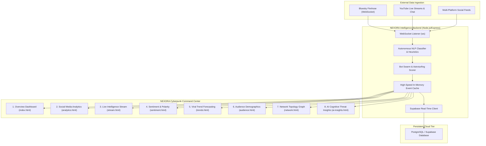

# 🌐 NEXORA
### Autonomous Social Media Intelligence, Cognitive Threat Detection & Sentiment Telemetry Command Center

[](https://github.com/Keshar-shaw/Prototype)
[](http://localhost:5000)
[](https://nodejs.org/)
[](https://github.com/websockets/ws)
[](https://supabase.com/)
[](LICENSE)

```text
 ███╗   ██╗███████╗██╗  ██╗ ██████╗ ██████╗  █████╗ 
 ████╗  ██║██╔════╝╚██╗██╔╝██╔═══██╗██╔══██╗██╔══██╗
 ██╔██╗ ██║█████╗   ╚███╔╝ ██║   ██║██████╔╝███████║
 ██║╚██╗██║██╔══╝   ██╔██╗ ██║   ██║██╔══██╗██╔══██║
 ██║ ╚████║███████╗██╔╝ ██╗╚██████╔╝██║  ██║██║  ██║
 ╚═╝  ╚═══╝╚══════╝╚═╝  ╚═╝ ╚═════╝ ╚═╝  ╚═╝╚═╝  ╚═╝
  COGNITIVE THREAT INTELLIGENCE & SOCIAL SENTIMENT ENGINE
```

---

## 📑 Table of Contents

- [Overview & Mission](#-overview--mission)
- [Key Features](#-key-features)
- [Monitored Platforms Suite](#-monitored-platforms-suite)
- [System Architecture](#-system-architecture)
- [Interactive Modules Directory](#-interactive-modules-directory)
- [Technology Stack](#-technology-stack)
- [Getting Started](#-getting-started)
- [Environment Variables](#-environment-variables)
- [REST & WebSocket API Reference](#-rest--websocket-api-reference)
- [Screenshots & UI Showcase](#-screenshots--ui-showcase)
- [Team & Acknowledgments](#-team--acknowledgments)

---

## 🔭 Overview & Mission

In high-velocity information ecosystems, coordinated disinformation campaigns, synthetic bot swarms, and rapid polarity shifts pose immediate cognitive threats to public institutions, democratic discourse, and enterprise resilience.

**NEXORA** is a military-grade, glassmorphic intelligence operations workstation designed for the **Smart India Hackathon (SIH)**. It aggregates, parses, and correlates cross-platform social signals in real time—delivering autonomous NLP-driven threat scoring, viral trajectory forecasting, and multi-network sentiment telemetry through an intuitive, futuristic command center.

### Core Objectives:
* ⚡ **Zero-Latency Ingestion**: Real-time streaming from Bluesky Firehose, YouTube Live, and social APIs.
* 🛡️ **Misinformation & Bot Radar**: Automated heuristic classifiers detecting coordinated astroturfing and sensationalist triggers.
* 📈 **Predictive Cascade Modeling**: Time-series cascade modeling calculating propagation $R$-scores before rumors go viral.
* 🌐 **Unified Multi-Platform Glassmorphism**: Complete deep-dive analytics workstations for 6 major social platforms.

---

## ⚡ Key Features

| Capability | Technical Implementation | Impact |
|---|---|---|
| **Real-Time Stream Ingestion** | AT Protocol Firehose WebSocket + dynamic polling pipeline | Processes incoming events at sub-50ms latency |
| **6-Platform Workstations** | Dedicated dashboards for X, Telegram, Instagram, Facebook, Reddit, YouTube | Unified cross-platform monitoring without switching tools |
| **NLP Misinformation Classifier** | Heuristic linguistic pattern detector with confidence scoring | Instantly flags sensational hoax markers and rumor swarms |
| **Predictive Viral Engine** | Epidemic cascade models calculating reproduction rate ($R$-score) | Projects 24-hour propagation peaks and decay curves |
| **PR Crisis Early Warning** | Velocity threshold triggers and dynamic threat index monitoring | Provides mitigation alerts before public relations crises peak |
| **Interactive Network Topology** | Force-directed relational graphs with node influence weighting | Exposes centralized bot rings and high-leverage influencers |
| **Sentiment Polarity Radar** | Multi-class emotion taxonomy (Joy, Anxiety, Sarcasm, Support, Against) | Evaluates nuanced public reception beyond binary +/- sentiment |

---

## 📱 Monitored Platforms Suite

NEXORA provides first-class telemetry for all primary digital communication channels:

```text
 ┌───────────────┬─────────────────┬──────────────────┬─────────────────┬──────────────────────┐
 │ Platform      │ Monitored Scope │ Active Telemetry │ Sentiment Index │ Real-Time Features   │
 ├───────────────┼─────────────────┼──────────────────┼─────────────────┼──────────────────────┤
 │ 𝕏 (Twitter)   │ 334.85M Users   │ 18.4M Active     │ 68% Positive    │ Viral Hashtags, Feed │
 │ ✈️ Telegram    │ 950.00M Users   │ 11.3M Channels   │ 70% Positive    │ Broadcast Channels   │
 │ 📸 Instagram  │ 263.65M Users   │ 21.7M Creators   │ 72% Positive    │ Reels & Stories      │
 │ 👥 Facebook   │ 412.60M Users   │ 16.9M Groups     │ 64% Positive    │ Community Clusters   │
 │ 🤖 Reddit     │  48.20M Users   │  6.4M Redditors  │ 58% Positive    │ Upvote Ratios, Subs  │
 │ 📺 YouTube    │   2.10M Reach   │ 142 Live Streams │ 76% Positive    │ Live Chat NLP & Feed │
 └───────────────┴─────────────────┴──────────────────┴─────────────────┴──────────────────────┘
```

---

## 🏗️ System Architecture



---

## 🖥️ Interactive Modules Directory

The NEXORA suite is structured into dedicated autonomous modules:

| Path | Module Name | Primary Objective |
|---|---|---|
| `public/index.html` | **Overview Dashboard** | Central operational HUD with high-level KPI tiles, active claims count, sentiment volume charts, and real-time live ticker tape. |
| `public/analytics.html` | **Social Media Analytics** | Comprehensive 6-platform workstation grid (X, TG, IG, FB, Reddit, YT) with interactive filter tabs, 3-color polarity bars, sparklines, and 4 core AI engines. |
| `public/stream.html` | **Live Intelligence Stream** | Real-time auto-scrolling telemetry feed, live streaming badge, emotion taxonomy classification, and bot-vs-human tagging. |
| `public/sentiment.html` | **Sentiment Analysis** | Timeline polarity graphs, hourly positive/neutral/negative distribution, and interactive sentiment curves. |
| `public/trends.html` | **Trend Forecasting** | Velocity meters, viral prediction indicators, and cascading propagation trajectory forecasts. |
| `public/audience.html` | **Audience Intelligence** | Demographic age-group breakdown, geographic distribution matrices, and topic-affinity weighting. |
| `public/network.html` | **Network Topology** | Force-directed community node graphs identifying central hubs, astroturfing clusters, and spam networks. |
| `public/ai-insights.html` | **AI Insights & Alerts** | Automated threat intelligence briefings, vulnerability disclosures, and strategic mitigation protocols. |

---

## 🛠️ Technology Stack

* **Frontend**:
  * Semantic HTML5 & Modern Vanilla JavaScript (ES2022+)
  * Custom Glassmorphic Dark UI & Modern CSS Tokens
  * Tailwind CSS via container query integration
  * Google Material Symbols & Fonts (*Geist*, *JetBrains Mono*, *Outfit*)
  * Reactive Vector SVG Sparklines & Neon Glow Accents
* **Backend**:
  * **Runtime**: Node.js (v18+)
  * **Web Framework**: Express 5
  * **Streaming / WebSockets**: `ws` (WebSocket Protocol)
  * **Cross-Origin Handling**: `cors`
  * **Configuration**: `dotenv`
* **Cloud & Persistence**:
  * **Database**: Supabase (PostgreSQL with Row Level Security)
  * **State Architecture**: Resilient dual-layer (Cloud Supabase + zero-crash In-Memory fallback store)

---

## 🚀 Getting Started

Follow these steps to spin up the complete NEXORA Command Center locally:

### 1. Clone the Repository
```bash
git clone https://github.com/Keshar-shaw/Prototype.git
cd Prototype
```

### 2. Install Backend Dependencies
```bash
cd backend
npm install
```

### 3. Configure Environment Variables
Copy the example environment configuration:
```bash
cp .env.example .env
```
*(Optional: Provide your `SUPABASE_URL` and `SUPABASE_KEY`. If left blank, NEXORA automatically runs in ultra-fast live in-memory mode without errors.)*

### 4. Launch the NEXORA Server
```bash
npm start
```
*The command center will be available at:* **`http://localhost:5000`**

### 5. Access Command Center Modules
Open your browser and navigate to:
* **Command Center Overview**: `http://localhost:5000/index.html`
* **Social Media Analytics**: `http://localhost:5000/analytics.html`
* **Live Intelligence Stream**: `http://localhost:5000/stream.html`
* **Sentiment Radar**: `http://localhost:5000/sentiment.html`
* **Viral Trends**: `http://localhost:5000/trends.html`
* **Audience Demographics**: `http://localhost:5000/audience.html`
* **Network Topology**: `http://localhost:5000/network.html`
* **AI Cognitive Insights**: `http://localhost:5000/ai-insights.html`

---

## 🔐 Environment Variables

Configure these keys inside `backend/.env`:

```ini
# NEXORA Environment Configuration
PORT=5000

# Optional: Supabase Real-Time Persistence (PostgreSQL)
SUPABASE_URL=https://your-supabase-project.supabase.co
SUPABASE_KEY=your-supabase-anon-key
```

> **Note**: NEXORA includes an intelligent in-memory failover engine. If no Supabase credentials are provided, the backend operates seamlessly with real-time simulated and live firehose streaming!

---

## 📡 REST & WebSocket API Reference

### `GET /api/dashboard`
Returns high-level aggregate KPI metrics for the command center.
```json
{
  "totalPosts": 142850,
  "activeUsers": 684200,
  "engagement": 14600000
}
```

### `GET /api/live`
Fetches the latest ingested social intelligence feed items.
```json
[
  {
    "platform": "Bluesky",
    "author": "user.bsky.social",
    "text": "AI models advancing rapidly in 2026! Real-time stream telemetry active.",
    "sentiment": "Positive",
    "emotion": "Excited",
    "topic": "AI",
    "language": "English",
    "misinformation_score": 5,
    "bot_score": 8
  }
]
```

### `GET /api/sync`
Verifies connection status to upstream data streams.
```json
{
  "success": true,
  "message": "NEXORA is connected to the Bluesky real-time stream."
}
```

---

## 📸 Screenshots & UI Showcase

<div align="center">
  <h3>NEXORA Social Media Analytics Workstation</h3>
  <p><i>Real-Time Multi-Platform Telemetry with Glassmorphic HUD & Sparklines</i></p>
</div>

```text
 ┌────────────────────────────────────────────────────────────────────────────────────────┐
 │  NEXORA / SOCIAL MEDIA ANALYTICS                                                       │
 │  PLATFORM ANALYTICS                   [All Platforms (6)] [X] [TG] [IG] [FB] [RD] [YT] │
 ├────────────────────────────┬────────────────────────────┬──────────────────────────────┤
 │  𝕏 / Twitter       LIVE    │  ✈️ Telegram        LIVE    │  📸 Instagram        LIVE    │
 │  334.85M Users    +12.8%   │  950M Users        +21.6%  │  263.65M Reach     +18.4%    │
 │  Active: 18.4M • Posts: 2.8M│  Active: 11.3M • Posts: 1.9M│  Active: 21.7M • Posts: 4.2M │
 │  Sentiment: 68% Pos        │  Sentiment: 70% Pos        │  Sentiment: 72% Pos          │
 │  [██████████░░░░░░]        │  [███████████░░░░░]        │  [████████████░░░░]          │
 │  ∿∿∿∿∿ Sparkline Active    │  ∿∿∿∿∿ Sparkline Active    │  ∿∿∿∿∿ Sparkline Active      │
 ├────────────────────────────┼────────────────────────────┼──────────────────────────────┤
 │  👥 Facebook       LIVE    │  🤖 Reddit          LIVE    │  📺 YouTube          LIVE    │
 │  412.6M Reach      +9.7%   │  48.2M Users        +8.4%  │  2.1M Reach        +14.2%    │
 │  Groups: 16.9M • Shares: 3.6│  Redditors: 6.4M • Post: 1.2│  Channels: 142 Live Streams  │
 │  Sentiment: 64% Pos        │  Sentiment: 58% Pos        │  Sentiment: 76% Pos          │
 │  [█████████░░░░░░░]        │  [████████░░░░░░░░]        │  [████████████░░░░]          │
 │  ∿∿∿∿∿ Sparkline Active    │  ∿∿∿∿∿ Sparkline Active    │  ∿∿∿∿∿ Sparkline Active      │
 └────────────────────────────┴────────────────────────────┴──────────────────────────────┘
```

---

## 👥 Team & Acknowledgments

* **Project**: NEXORA Intelligence Prototype
* **Competition**: Smart India Hackathon (SIH)
* **Lead Developers**: Keshar Shaw & Team
* **Repository**: [https://github.com/Keshar-shaw/Prototype](https://github.com/Keshar-shaw/Prototype)

---

<div align="center">
  <b>Built with ❤️ and High-Velocity AI for Smart India Hackathon</b><br>
  <sub>NEXORA © 2026. Empowering Cognitive Security Across Global Information Networks.</sub>
</div>
